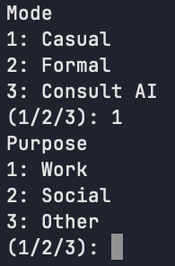
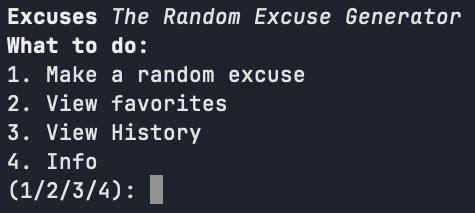
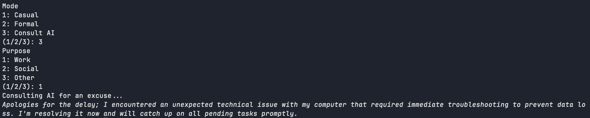
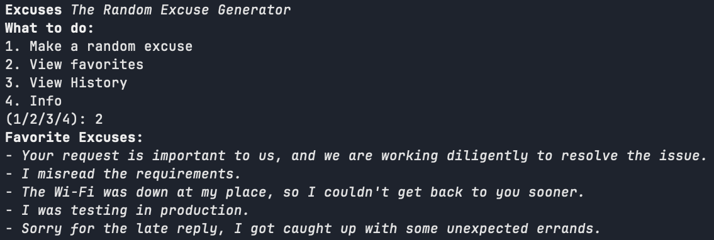
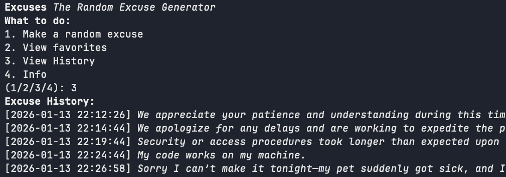

# Excuses
## The Random Excuse Generator
A simple CLI tool that generates random excuses for various situations.
### Features
- Generate excuses from two categories and three purposes: 
  - Categories: Personal, Work
  - Purposes: Late, Absent, Incomplete

- Easy to use command-line interface

- Now featuring optional AI-generated excuses

- Favorite your excuses for quick access

- View your history of generated excuses

### Installation
1. Clone the repository:
    ```bash
    git clone https://github.com/sohiearth/excuses.git
    ```
2. Navigate to the project directory:
    ```bash
    cd excuses
    ```
3. Install the required dependencies:
    - nlohmann/json for JSON handling
    - curl/curl for HTTP requests
4. Build the project using clang, g++ or any C++ compiler of choice. Info: You will need C++20 or higher.
For context, here's the command I use to build this project (I use macOS with Homebrew):
    ```bash
    clang++ -std=c++20 -o excuses main.cc -lcurl -I /opt/homebrew/Cellar/nlohmann-json/3.12.0/include
    ```
### Usage
Invoke the executable. Initial setup should guide you through generating your first excuse.
### Customization
You can modify the database by simply editing the .txt files located in the same directory as the executable.
